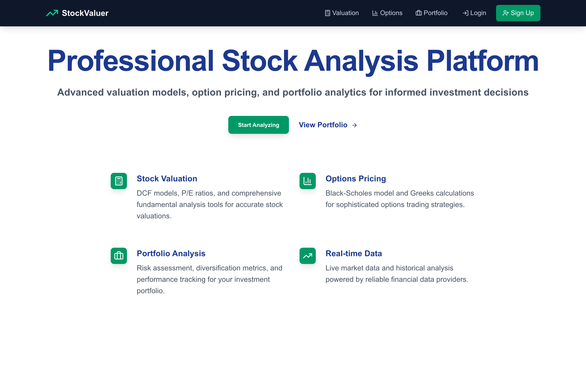
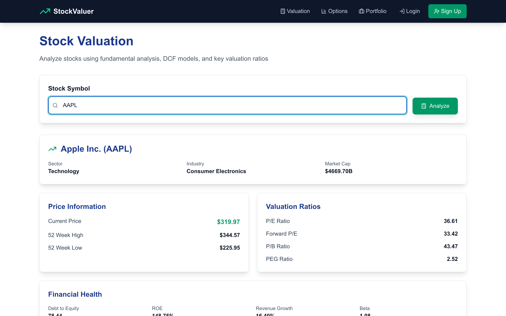
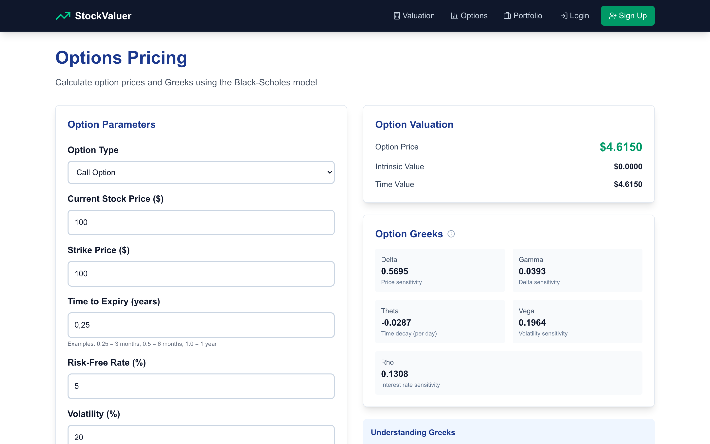

# Stock Analysis Platform

A comprehensive web application for stock valuation, options pricing, and portfolio analysis built with React/Next.js and Python FastAPI.

## Screenshots

| Landing | Stock Valuation | Options Pricing |
|---|---|---|
|  |  |  |

## Features

- **Stock Valuation**: DCF models, P/E ratios, fundamental analysis with real-time data
- **Options Pricing**: Black-Scholes model with Greeks calculations (delta, gamma, theta, vega, rho)
- **Portfolio Analysis**: Track investments and analyze portfolio performance
- **Interactive Charts**: Multiple timeframes (3h, 1d, 5d, 1mo, 3mo, 6mo, 1y, 2y, 5y, max) with Poland timezone support
- **Real-time Data**: Integration with Yahoo Finance API via yfinance library

## Technology Stack

### Frontend
- **Next.js 14** with TypeScript
- **React** with modern hooks
- **Tailwind CSS** for styling
- **Recharts** for data visualization
- **Lucide React** for icons

### Backend
- **Python FastAPI** with async support
- **pandas & numpy** for data processing
- **scipy** for financial calculations
- **yfinance** for real-time stock data
- **CORS middleware** for cross-origin requests

## Prerequisites

Make sure you have the following installed on your system:

- **Node.js** (version 18 or higher)
- **npm** or **yarn**
- **Python** (version 3.8 or higher)
- **pip** (Python package installer)

## Installation & Setup

### 1. Clone the Repository

```bash
git clone <your-repository-url>
cd Stock
```

### 2. Backend Setup

Navigate to the project root directory:

```bash
cd /Users/nazkostiv/Stock
```

Create and activate a Python virtual environment:

```bash
# Create virtual environment
python3 -m venv venv

# Activate virtual environment
# On macOS/Linux:
source venv/bin/activate
# On Windows:
# venv\Scripts\activate
```

Install Python dependencies:

```bash
pip install fastapi uvicorn pandas numpy scipy yfinance python-multipart
```

Start the FastAPI backend server:

```bash
python main.py
```

The backend will be available at: `http://localhost:8000`

### 3. Frontend Setup

Open a new terminal and navigate to the frontend directory:

```bash
cd /Users/nazkostiv/Stock/frontend
```

Install Node.js dependencies:

```bash
npm install
```

Start the Next.js development server:

```bash
npm run dev
```

The frontend will be available at: `http://localhost:3000`

## Project Structure

```
Stock/
├── README.md
├── backend/
│   ├── main.py             # FastAPI main application
│   ├── routers/
│   │   ├── stocks.py       # Stock data API endpoints
│   │   ├── options.py      # Options pricing endpoints
│   │   └── valuation.py    # Valuation endpoints
│   └── tests/              # API tests (pytest)
├── frontend/
│   ├── src/
│   │   ├── app/
│   │   │   ├── layout.tsx
│   │   │   ├── page.tsx    # Homepage
│   │   │   ├── valuation/  # Stock valuation page
│   │   │   ├── options/    # Options pricing page
│   │   │   └── portfolio/  # Portfolio analysis page
│   │   └── components/
│   │       ├── layout/     # Header, navigation
│   │       └── charts/     # Chart components
│   ├── e2e/                # Playwright end-to-end tests
│   ├── playwright.config.ts
│   └── package.json
```

## API Endpoints

### Stock Data
- `GET /api/stocks/{symbol}/info` - Get stock information
- `GET /api/stocks/{symbol}/history` - Get historical price data
- `GET /api/stocks/{symbol}/financials` - Get financial statements
- `GET /api/stocks/search/{query}` - Search for stocks

### Options Pricing
- `POST /api/options/black-scholes` - Calculate option prices and Greeks

### Valuation
- `POST /api/valuation/dcf` - Discounted Cash Flow analysis

## Chart Timeframes

The application supports multiple timeframes with specific data intervals:

- **3h**: 15-minute intervals (last 3 hours)
- **1d**: Daily data (last trading day)
- **5d**: Daily data (5 trading days)
- **1mo, 3mo, 6mo**: Daily data
- **1y, 2y, 5y**: Daily data
- **max**: All available historical data

**Note**: Times are displayed in Poland timezone (CET/CEST).

## Data Limitations

- **1-minute data**: Only available for the last 7 days (Yahoo Finance limitation)
- **Real-time data**: Market data is provided by Yahoo Finance with standard delays
- **Weekend data**: Shows last trading day (Friday) data when accessed on weekends

## Development

### Running in Development Mode

1. **Backend**: `python main.py` (runs on port 8000)
2. **Frontend**: `npm run dev` (runs on port 3000)

### Environment Variables

No environment variables are required for basic setup. The application uses default configurations.

### Code Style

- **Frontend**: Uses TypeScript with strict mode, ESLint, and Prettier
- **Backend**: Follows Python PEP 8 standards with FastAPI conventions

### Testing

**Backend API tests** (pytest + FastAPI TestClient; market data is mocked, so no network needed):

```bash
cd backend
pip install -r requirements-dev.txt
pytest
```

Covers Black-Scholes pricing against reference values, put-call parity, Greeks bounds,
implied-volatility round-trips, input validation, and DCF valuation consistency.

**End-to-end tests** (Playwright; starts both servers automatically):

```bash
cd frontend
npx playwright install chromium
npm run test:e2e
```

Both suites run in CI on every push and pull request.

## Troubleshooting

### Common Issues

1. **Port conflicts**: Make sure ports 3000 and 8000 are available
2. **Python dependencies**: Ensure all packages are installed in the virtual environment
3. **Node.js version**: Use Node.js 18+ for compatibility
4. **CORS errors**: Backend includes CORS middleware for localhost development

### Data Issues

1. **No chart data**: Some timeframes may not have data on weekends or holidays
2. **API errors**: Yahoo Finance API may have temporary outages
3. **Timezone display**: Times automatically convert to Poland timezone (CET/CEST)

## Contributing

1. Fork the repository
2. Create a feature branch
3. Make your changes
4. Test thoroughly
5. Submit a pull request

## License

This project is for educational and personal use. Please respect Yahoo Finance's terms of service when using their data.